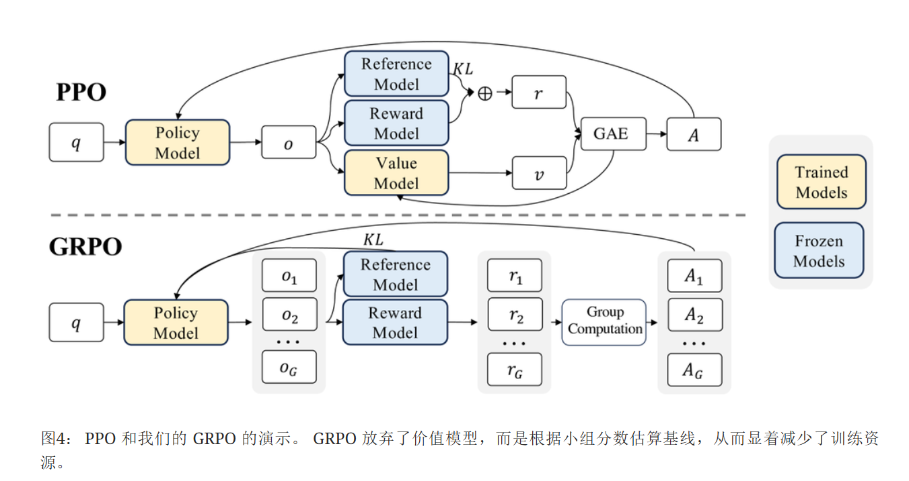
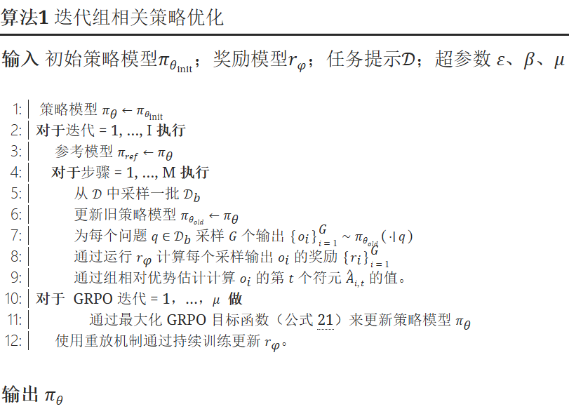

# 1 deepseek RL GRPO (Group Relative Policy Optimization)

&nbsp;&nbsp;&nbsp;&nbsp;&nbsp;&nbsp;&nbsp;&nbsp;在强化学习（RL）中，仅仅知道“你得了多少分”往往是不够的。单纯追求高分可能会导致各种副作用，比如过度探索、模型不稳定，甚至产生偏离合理策略的“走捷径”行为。为了解决这些挑战，强化学习引入了多种机制，如评论者（价值函数）、裁剪操作、参考模型，以及最近提出的群相对策略优化（GRPO）。 

&nbsp;&nbsp;&nbsp;&nbsp;&nbsp;&nbsp;&nbsp;&nbsp;为了让这些概念更加直观，我们来打个比方：把强化学习的训练过程想象成小学考试的场景。我们（正在训练的模型）就像是**学生**，努力争取高分；给老师批改试卷就像**奖励模型**，而父母根据我们的成绩给零花钱则类似于**评论者**的作用。接下来，我们一步步来探讨为什么仅看最终分数是不够的，评论者、裁剪操作和参考模型是如何发挥作用的，以及GRPO是如何扩展这些理念的。 

# 2 仅使用奖励模型(Reward Model)

假设我和弟弟在同一个小学班级。老师给我们的考试打分，给出“绝对分数”。我通常能得80分以上（满分100分），而弟弟常常只得30分左右。然后，我们直接拿着这些分数去找爸爸要零花钱——也就是说，我们的“奖励”（在强化学习的术语中）就是我们的原始考试分数。谁得分高，谁得到的零花钱就多。

乍一看，这似乎没什么问题。但很快就出现了两个大问题：

不公平：如果弟弟通过努力学习，从30分提高到60分，但与我通常的80多分相比，仍然相形见绌。他并没有得到应有的鼓励。

不稳定：我自己为了追求更高的分数，可能会采**取极端的学习方法**（例如，不分昼夜地死记硬背，熬夜到很晚）。有时我可能得95分，有时却只得60分，因此我的分数——以及由此产生的奖励信号——**波动很大**。 

结果，`使用绝对分数作为奖励会导致奖励波动很大，而我弟弟最终会觉得，一点点地进步根本不值得。`  

**数学对应关系**  

在RL中，如果我们仅这样做： 

$$J_{\text{naive}}(\theta) = \mathbb{E}_{(q,o) \sim (\text{data}, \pi_\theta)}[r(o)]$$

这意味着“仅优化最终奖励”，我们可能会遇到`高方差和对部分改进激励不足的问题`。换句话说，行动者（Actor）缺乏一个与其当前水平相匹配的基准，这会妨碍训练效率。 

# 3 引入评论者(Value Module)：使用“预测分数线”来改进奖励

认识到这个问题后，爸爸意识到“重要的不仅仅是绝对分数，还有相对于你当前水平的进步程度”。

于是他决定：

把我的**预测分数线**定在80分，我弟弟的定在40分。如果我们考试超过这些分数线，就能得到更多零花钱；如果没达到，就只能得到很少或者根本没有。

因此，如果我弟弟努力学习，从30分跳到60分，他就比他的“预测分数线”高出20分，这将转化为丰厚的奖励。与此同时，如果我保持在80分左右，那么增量收益就较小，所以我并不一定比他得到的多很多。这样的安排鼓励每个人从自己的基线出发去进步，而不是单纯比较绝对分数。

当然，爸爸很忙，所以一旦设定了分数线，它并不会保持不变——他需要根据我们的进步不断“调整”。如果我弟弟的水平提升到60分左右，那么40分的基线就不再公平了。同样，如果我一直徘徊在85分左右，爸爸可能也需要调整我的分数线。换句话说，爸爸也需要学习，特别是要了解我和弟弟进步的速度。

**数学对应关系**  

在强化学习中，这个“分数线”被称为**价值函数 $V_\psi(s)$** 它作为一个基准。我们的训练目标从“仅奖励”演变为“我们超出这个基准多少”，这通过优势（Advantage）来表达：

$$A_t = r_t - V_\psi(s_t)$$

对于给定的状态 \(s_t\) 和动作 \(o_t\)，如果实际奖励超过了评论者的预期，就意味着执行的动作比预测的要好。如果实际奖励较低，则该动作表现不佳。在最简单的形式中，我们优化的是类似这样的目标：

$$ J_{\text{adv}}(\theta) = \mathbb{E}[A(o)] $$

$$ A(o) = r(o) - V_\psi(o) $$

通过`减去这个分数线`，我们减少了训练中的**方差**，对超出预期的动作给予更高的梯度信号，并对未达到预期的动作进行惩罚。

# 4 添加裁剪和最小值操作：防止过度更新

即使有了“分数线”，也可能出现新的问题。例如：

如果我突然在考试中取得突破，得了95分或100分，爸爸可能会给我巨额奖励，促使我在下次考试前采取过于激进的学习模式。我的成绩可能会在极端之间波动（95分和60分），导致奖励大幅波动。

因此，爸爸决定适度调整我每一步更新学习策略的幅度——他`不会仅仅因为一次考试考得好就给我指数级更多的零花钱。`如果给得太多，我可能会走向*极端探索*；如果给得太少，我又会缺乏动力。所以他必须找到一种平衡。

**数学对应关系**  

在PPO（近端策略优化）中，这种平衡是通过“裁剪”机制实现的。PPO目标的核心包括：

$$\min\left(r_t(\theta)A_t, \text{clip}\left(r_t(\theta), 1 - \epsilon, 1 + \epsilon\right)A_t\right)$$

其中

$$r_t(\theta) = \frac{\pi_\theta(o_t \mid s_t)}{\pi_{\theta_{\text{old}}}(o_t \mid s_t)}$$

表示对于该动作，*新策略和旧策略之间的概率比率*。如果比率偏离1太远，它会被裁剪到\([1 - \epsilon, 1 + \epsilon]\)范围内，这限制了策略在一次更新中可以改变的程度。 

用更简单的话来说： 

考100分能让我获得额外奖励，但爸爸设定了一个“上限”，以防止我过度。然后，他会在下次考试时重新评估，保持一种稳健的方法，而不是助长极端波动。 

# 5 参考模型(Reference Model)：防止作弊和极端策略

即便如此，如果我仅仅盯着高分，我可能会采取一些可疑的手段——比如作弊或威胁老师给我打满分。显然，这违反了所有规则。在大型语言模型的领域，类似的情况就是生成有害或虚构的内容来人为地提高某些奖励指标。

因此，爸爸设定了一条额外的规则：

“无论如何，你都不能太偏离你最初、诚实的学习方法。如果你偏离了你的基线太多，即使分数很高，我也会取消你的资格，并扣发你的零花钱。”

这类似于在学期开始时（即初次**监督微调后**）划定一条“参考线”。你不能偏离那条最初的策略太远，否则就会面临惩罚。

**数学对应关系**  

在PPO中，这通过添加一个**针对参考模型（即初始策略）的KL散度惩罚**来体现。具体来说，我们在损失函数中加入类似以下的内容：

$$-\beta D_{\text{KL}}(\pi_\theta \, \| \, \pi_{\text{ref}})$$

这可以防止行动者（Actor）偏离原初的、合理的策略太远，从而避免“作弊”或其他极端越界行为。

# 6 GRPO：用“多个模拟平均值”替代价值函数（取消Value Model）
&nbsp;&nbsp;&nbsp;&nbsp;&nbsp;&nbsp;&nbsp;&nbsp;有一天，爸爸说：“我没有时间一直评估你们的学习进度，并不断画出新的分数线。为什么不先做五组**模拟测试**，然后取它们的平均分作为你的预期分数呢？如果你在真实测试中超过了这个平均分，那就说明你做得比自己的预期好，所以我会奖励你。否则，你得不到太多奖励。”我和弟弟，以及可能还有更多的同学，都可以依靠各自的一组模拟测试，而不是爸爸需要不断调整的外部“价值网络”。

&nbsp;&nbsp;&nbsp;&nbsp;&nbsp;&nbsp;&nbsp;&nbsp;到目前为止，我们看到`PPO依赖于Actor（行动者）+ Critic（评论家）+ Clip（裁剪）+ KL惩罚框架` 。然而，在大型语言模型（LLM）场景中，Critic（价值函数）往往需要与Actor**一样大**，才能准确评估状态，这可能会很昂贵，有时也不切实际——特别是如果你只在最后得到一个最终奖励（比如最终答案的质量）。

因此，group相对策略优化（GRPO）应运而生。其核心思想是：

- 不需要为Critic设置单独的value network，
- 对同一问题或状态，**从旧策略中采样多个输出**，
- 将这些输出的平均奖励视为基线，
- 任何高于平均值的都产生“正优势”，任何低于平均值的都产生“负优势”。

同时，GRPO保留了PPO的Clip和KL机制，以确保稳定、合规的更新。

**数学对应关系**

根据DeepSeekMath的技术报告，GRPO（群体相对策略优化）的目标函数（省略了一些符号）为：

$$J_{\text{GRPO}}(\theta) = \mathbb{E}\left[ \sum_{i=1}^{G} \left( \min\left( \frac{\pi_{\theta}(o_i)}{\pi_{\theta_{\text{old}}}(o_i)} A_i, \text{clip}\left( \frac{\pi_{\theta}(o_i)}{\pi_{\theta_{\text{old}}}(o_i)}, 1 - \epsilon, 1 + \epsilon \right) A_i \right) - \beta D_{\text{KL}}(\pi_{\theta} \, \| \, \pi_{\text{ref}}) \right) \right],$$

其中

$$A_i = \frac{r_i - \text{mean}(\{r_1, r_2, \cdots, r_G\})}{\text{std}(\{r_1, r_2, \cdots, r_G\})}$$

&nbsp;&nbsp;&nbsp;&nbsp;&nbsp;&nbsp;&nbsp;&nbsp;`通过对同一问题的多个输出求平均并进行归一化，计算出一个“相对分数”`。这样，我们就不再需要一个专门的价值函数，但仍然可以得到一个动态的“分数线”，从而**简化训练并节省资源**。 

# 7 结论：回顾与未来展望

通过小学考试的类比，我们一步步从原始的绝对分数，到PPO的完整机制（Critic、Advantage、Clip、Reference Model），最后到GRPO（利用多个输出的平均分数来消除价值函数）。以下是一些关键要点：

Critic的作用：为每个状态提供一个“合理预期”，显著减少训练方差。

Clip & min机制：限制更新幅度，防止对某一次“突破性”考试过度反应。

Reference Model（参考模型）：防止“作弊”或极端偏差，确保策略与其初始状态保持合理一致。

GRPO的优势：在大型语言模型中，它消除了对单独价值网络的需求，降低了内存和计算成本，同时与“比较式”奖励模型设计很好地契合。

就像爸爸转而“让孩子们自己模拟多次考试，然后将他们的平均分作为基线”一样，GRPO避免了维护一个庞大的Critic，同时仍然提供了相对奖励信号。它保留了PPO的稳定性和合规性特性，但简化了过程。

希望这篇文章能帮助你自然地掌握PPO和GRPO。如果你对过程监督或迭代强化学习等话题感兴趣，请关注我的博客以获取更多更新。

# 8 deepseek-GRPO

# 参考连接
- [论文连接-EN](https://arxiv.org/pdf/2402.03300)
- [DeepSeekMath](https://yiyibooks.cn/arxiv/2402.03300v3/index.html)
- [huggingface](https://huggingface.co/blog/NormalUhr/grpo)