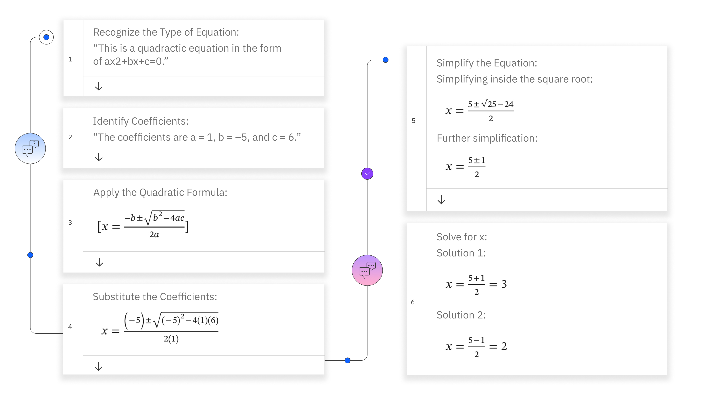

# 1 How does chain-of-thought prompting work?

思维链提示利用大型语言模型（LLM）来阐述一系列推理步骤，引导模型为新任务生成类似的推理链(reasoning steps)。这是通过**示例性提示实现的**，这些提示展示了推理过程，从而增强了模型解决复杂推理挑战的能力。让我们通过解决一个经典的数学应用题——多项式方程，来理解这种提示技术的流程。 

# 2 示例：思维链提示如何解决多项式方程？

思维链（CoT）提示通过引导大型语言模型（LLM）遵循一系列逻辑步骤，分解问题解决过程，可以显著帮助解决多项式方程。2 让我们来看看思维链提示如何解决一个多项式方程。

以求解一个二次方程为例。

输入提示：求解二次方程：x² - 5x + 6 = 0

当我们将这个提示给到IBM watsonx.ai聊天机器人时，可以看到以下人与AI助手之间的对话。

为了生成这种类型的输出，思维链的基本原理如以下图像所示。思维链的最终答案是：“方程 x² − 5x + 6 = 0 的解是 x = 3 和 x = 2”。

# 3 Chain of thought prompting

CoT提示已发展出各种创新变体，每种变体都旨在应对特定挑战，并以独特方式增强模型的**推理能力**。这些改编不仅扩展了思维链在不同领域的应用范围，还优化了模型的问题解决过程。

## 3.1 Zero-shot chain of thought (零样本 CoT)

零样本思维链变体**利用模型内在的知识来解决问题**，而无需针对当前任务提供特定的先前示例或进行微调。这种方法在处理新型或多样化问题类型时特别有价值，因为这些类型的问题可能无法获得定制的训练数据。这种方法可以利用标准提示和少样本提示的特性。

例如，当回答“与法国接壤且国旗为红白相间的国家的首都是什么？”这一问题时，使用零样本思维链的模型会利用其内置的地理和国旗知识，推导出瑞士作为答案的步骤，尽管它并未针对此类查询进行过明确训练。

## 3.2 Automatic chain of thought

自动思维链（auto-CoT）旨在通过**自动化生成和选择有效的推理路径**，来最小化手工设计提示所需的努力。这种变体提高了思维链提示的可扩展性和可访问性，使其适用于更广泛的任务和用户群体.

例如，为了解决像“如果你买了5个苹果，并且已经有了3个，那么你总共有多少个？”这样的数学问题，一个自动思维链系统可以自动生成中间步骤，如“从3个苹果开始”和“将5个苹果加到现有的3个上”，最终得出“总苹果数=8”，从而无需人工干预即可简化推理过程。

## 3.3 Multimodal chain of thought

多模态思维链将思维链框架扩展到能够融入来自多种模态的输入，如文本和图像，使模型能够处理并整合不同类型的信息以完成复杂的推理任务。

例如，当展示一张拥挤的海滩场景图片，并询问“这个海滩在夏天可能受欢迎吗？”时，采用多模态思维链的模型可以分析视觉线索（包括海滩人流量、天气条件等）以及其对季节性流行度的文本理解，从而推理出一个详细的回答，如“海滩很拥挤，表明其很受欢迎，夏天可能会更加热闹”。

这些思维链提示的变体不仅展示了思维链方法的灵活性和适应性，还暗示了人工智能推理和问题解决能力未来发展的巨大潜力。

# 4 Advantages and limitations

思维链提示是一种强大的技术，能够提升大型语言模型（LLMs）在复杂推理任务上的表现，在多个领域如提高准确性、透明度和多步推理能力方面带来显著益处。然而，必须考虑其局限性，包括对高质量提示的需求、计算成本的增加、易受对抗性攻击的影响，以及在评估推理或理解方面的定性改进时所面临的挑战。通过解决这些局限性，研究人员和从业人员可以确保思维链提示在多种应用中得到负责任且有效的部署。

## 4.1 Advantages of chain of thought prompting

思维链提示为用户带来了诸多好处，其中包括：

改进的提示输出：思维链提示通过将复杂的推理任务分解成更简单、更符合逻辑的步骤，提高了大型语言模型在这些任务上的表现。

透明度和理解性：生成中间推理步骤使得模型得出结论的过程更加透明，使用户更容易理解决策过程。

多步推理：通过系统地处理问题的每个组成部分，思维链提示通常能得出更准确、更可靠的答案，特别是在需要多步推理的任务中。多步推理指的是将复杂的逻辑运算分解成更小、顺序执行的步骤的能力。这种认知技能对于解决复杂问题、做出决策以及理解因果关系至关重要。

注重细节：逐步解释模型类似于通过详细分解来鼓励理解的教学方法，使得思维链提示在教育环境中非常有用。

多样性：思维链可以应用于广泛的任务，包括但不限于算术推理、常识推理和复杂问题解决，展示了其灵活的实用性。

## 4.2 Limitations of chain of thought prompting

以下是采用思维链过程中遇到的一些局限性：

- 质量控制：思维链提示的有效性高度依赖于**所提供提示的质量，需要精心设计的示例来准确引导模型**。

- 高计算能力需求：与标准的单步提示相比，生成和处理多个推理步骤**需要更多的计算能力和时间**。因此，这项技术对于任何组织来说采用成本都更高。

- 概念误导：存在生成看似合理但实际错误的推理路径的风险，从而导致误导性或错误的结论。

- 昂贵且劳动密集：**设计有效的思维链提示可能更复杂且劳动密集**，需要深入理解问题领域和模型的能力。

- 模型过拟合：存在模型过拟合提示中的推理风格或模式的风险，这可能会降低其在不同任务上的泛化能力。

- 评估和验证：虽然思维链可以增强可解释性和准确性，但测量推理或理解方面的定性改进可能具有挑战性。这是因为人类认知的固有复杂性和评估语言表达的主观性。然而，可以采用几种方法来评估思维链提示的有效性。例如，将模型的响应与基线模型或人类专家的响应进行比较，可以提供相对性能提升的见解。此外，分析大型语言模型生成的中间推理步骤可以提供对决策过程的宝贵见解，即使直接测量推理或理解方面的改进很困难。

# 5 思维链的进展

思维链（CoT）的演变见证了自然语言处理（NLP）、机器学习以及蓬勃发展的生成式人工智能等多个领域协同进步的成果。这些进步不仅将思维链推到了复杂问题解决的前沿，还凸显了其在广泛应用中的实用性。在此，我们将深入探讨关键的发展动态，并结合指定术语，全面描绘思维链的进展概况。

## 5.1 提示工程与原始提示

提示工程的创新极大地提升了模型对原始提示的理解与交互能力，从而生成更加细致且与上下文更契合的推理路径。这一进展对于提升思维链的有效性至关重要。

## 5.2 Symbolic reasoning and logical reasoning

将思维链融入符号推理任务和逻辑推理任务中，提高了模型的抽象思维和演绎能力，这标志着在利用思维链应对基于逻辑的挑战方面取得了重大突破。

例如，符号推理是解决数学方程，如2 + 3 = 5。在这种情况下，问题被分解成其组成部分（加法和数字），模型根据其学到的知识和推理规则推导出正确答案。另一方面，逻辑推理涉及从前提或假设中得出结论，如“所有的鸟都会飞，企鹅是鸟。”模型则会根据提供的信息推断出企鹅会飞。将思维链提示融入符号推理和逻辑推理任务中，使得大型语言模型展现出了更强的抽象思维和演绎能力，使它们能够应对更复杂和多样的问题。

## 5.3 Enhanced creativity

生成式人工智能和transformer架构的应用彻底改变了思维链，使得能够生成展现出创造性和深度的复杂推理路径。这种协同作用拓宽了思维链的适用范围，对学术和实践领域都产生了影响。

## 5.4 小型模型与自洽性

使小型模型能够有效进行思维链推理的进步，让先进的推理能力得以普及。思维链中对自洽性的关注确保了生成路径的逻辑合理性，提高了模型所得结论的可靠性。

## 5.5 AI assistant

将思维链（CoT）集成到聊天机器人中，并利用最先进的自然语言处理（NLP）技术，已经改变了对话式人工智能，使聊天机器人能够进行更复杂的交互，这些交互需要更深层次的理解和问题解决能力。

这些进步共同标志着思维链能力的飞跃，以及聊天机器人与思维链模型集成的重大意义，凸显了它们在革命化人工智能驱动的决策和问题解决过程中的潜力。通过将聊天机器人的对话能力与思维链模型的高级推理能力相结合，我们可以创建出更复杂、更有效的人工智能系统，能够处理更广泛的任务和应用。

此外，各种应用与思维链模型的集成可以通过使人工智能系统更好地理解和响应用户需求和偏好，从而提升整体用户体验。通过将自然语言处理技术集成到思维链模型中，我们可以使聊天机器人以更类似人类的方式理解和响应用户输入，从而创造出更具吸引力、更直观、更有效的对话体验。

# 6 Use cases for chain of thoughts

思维链（CoT）方法论能够将复杂问题分解为易于理解的推理步骤，因此已在众多领域得到了应用。这些应用案例不仅展示了思维链的多样性，还体现了其改变系统解决问题和决策任务方式的潜力。下面，我们将探讨几个思维链得到有效应用的突出案例。

## 6.1 客户服务聊天机器人

先进的聊天机器人利用思维链（CoT）来更好地理解和解决客户问题。通过将客户的问题分解成更小、更易管理的部分，聊天机器人可以提供更准确、更有帮助的回复，从而提高客户满意度，并减少对人工干预的需求。

## 6.2 研究与创新

研究人员利用思维链来构建解决复杂科学问题的思维过程，从而促进创新。这种结构化的方法可以加速发现过程，并有助于提出新的假设。

## 6.3 教育与学习

思维链在教育技术平台中发挥着重要作用，有助于为复杂问题生成分步骤的解释。这在数学和科学等学科中尤为重要，因为在这些学科中，理解过程与最终答案同样重要。基于思维链的系统可以引导学生完成问题解决过程，提高他们的理解和记忆力。

## 6.4 人工智能伦理与决策制定

思维链对于阐明人工智能驱动决策背后的推理至关重要，尤其是在需要考虑伦理因素的场景中。通过提供透明的推理路径，思维链确保人工智能决策符合伦理标准和社会规范。

这些应用案例凸显了思维链在各行各业中的变革潜力，展现了其重新定义问题解决和决策过程的能力。随着思维链的不断发展，其应用范围预计将进一步扩大，使这一方法论更加深入地融入技术和社会的进步之中。

思维链提示标志着人工智能在承担复杂推理任务方面取得了突破性进展，模仿了人类的认知过程。通过阐明中间推理步骤，思维链不仅增强了大型语言模型（LLMs）解决问题的能力，还提高了透明度和可解释性。尽管存在固有的局限性，但对思维链变体和应用的持续探索继续扩展着人工智能模型的推理能力，预示着人工智能认知功能未来的增强。

# 7 大模型中的 CoT ： Chain-of-Thought Prompting Elicits Reasoning in Large Language Models

- [论文链接-EN](https://arxiv.org/pdf/2201.11903)
- [论文链接-CN](https://yiyibooks.cn/arxiv/2201.11903v6/index.html)

# 参考资料
- [prompting-guide](https://www.promptingguide.ai/techniques/cot)
- [How does chain-of-thought prompting work?](https://www.ibm.com/think/topics/chain-of-thoughts)
- [Chain-of-Thought Prompting Elicits Reasoning in Large Language Models](https://arxiv.org/pdf/2201.11903)
